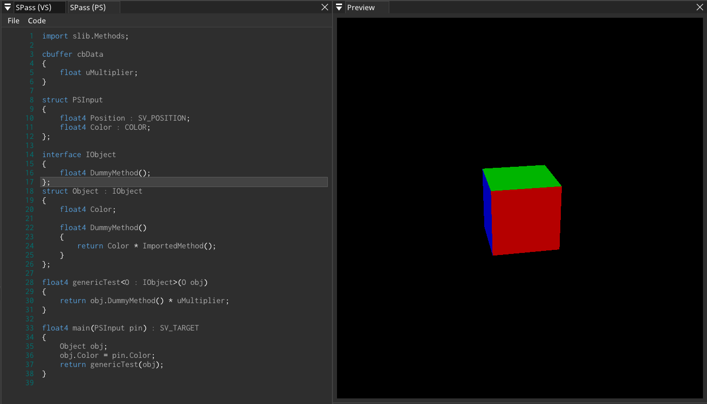

# PluginSlang
SHADERed plugin that adds [Slang](https://github.com/shader-slang/slang) shader language.



## How to build
Clone the project:

```bash
git clone https://github.com/dfranx/PluginSlang.git
git submodule update --init
```

Open `.sln` and press the build button.

(currently, only Windows is supported, but this project can easily be built on Linux too)

## How to install
Minimum requirements: SHADERed v1.3.5

Copy the .dll file to `plugins/Slang` folder in the SHADERed's installation directory.
